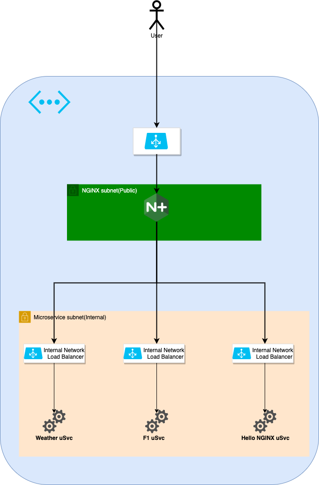

# azure-nginx-plus-with-nlb
This project is to create Azure infrastructure to deploy nginx plus as API Gateway load balanced with Azure Load Balancer

## Pre-requisite 
    1. Build the nginxplus image using packer ,follow the instructions
       here https://github.com/b-rajesh/nginxplus-packer-image-builder
    2. Build the following microservices image using packer, follow the instructions on each
       1. https://github.com/b-rajesh/hello-nginxplus
       2. https://github.com/b-rajesh/hello-f1
       3. https://github.com/b-rajesh/weather-api

    3. Enter admin_password int `terraform.tfvars` with value that satisfy azure - more than 6 letters, Alphanumeric and one upper case

### Base nginx plus project used 
    You don't have to check-out this project(explicitly) as it would be automatically used while building the nginx plus vm image
    https://github.com/b-rajesh/diy-nginx-plus-api-gateway

### Make sure you have az login completed with azure
```sh
$ az login
```
## Known issues***
    I am using Virtual Machine Scale set and it seems to have some issue with upgrading and updating the vm's while deploying, so its configured to be Manual for now.You may have to 
    login to Azure portal and manually upgrade the instances for the microservices thats present in the microservice resource group
    
## Initialize Terraform workspace
Initalize your Terraform workspace, which will download the provider and initialize it with the values provided in the terraform.tfvars file.

```sh

$ terraform init

Initializing the backend...

Initializing provider plugins...

The following providers do not have any version constraints in configuration,
so the latest version was installed.

To prevent automatic upgrades to new major versions that may contain breaking
changes, it is recommended to add version = "..." constraints to the
corresponding provider blocks in configuration, with the constraint strings
suggested below.

```

Then, run plan terraform plan.
```sh
$ terraform plan

# Output truncated...

Plan: 33 to add, 0 to change, 0 to destroy.
```

Run terraform apply. This will take approximately 10 minutes after your type yes - depends where you are running
```sh
# Output truncated...

Do you want to perform these actions?
  Terraform will perform the actions described above.
  Only 'yes' will be accepted to approve.

  Enter a value:
```

Output of the successful apply will look like this
```sh
# Output truncated...

Apply complete! Resources: 38 added, 0 changed, 0 destroyed.

Outputs:
# Output truncated...
```


## Highlevel Architecture


